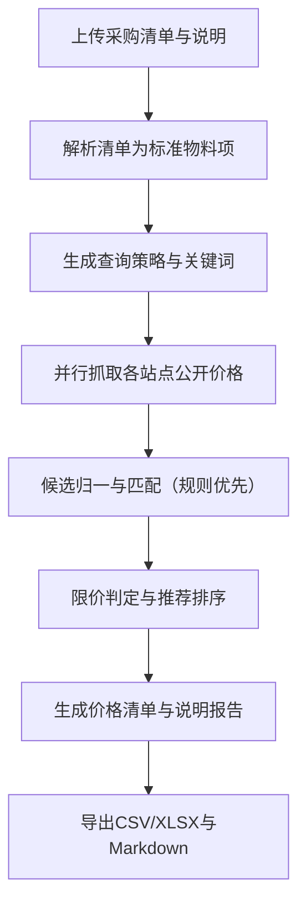

## 1. 产品概述
面向科研试剂/耗材采购场景的一次性查价工具：用户上传采购清单并补充采购说明/限价策略，系统在用户手动触发时抓取公开价格并生成可交付的价格清单与说明报告。
- 解决问题：多渠道比价耗时、规格/货号容易误配、结果缺少可追溯证据与限价合规说明
- 目标价值：快速输出“可采购”的比价结果（含来源链接与时间戳），减少人工查价与汇总成本

## 2. 核心功能

### 2.1 用户角色
| 角色 | 使用方式 | 核心权限 |
|------|----------|----------|
| 本地用户 | 无登录（MVP） | 配置模型、上传清单、触发查价、导出结果 |

### 2.2 功能模块
1. **查价工作台**：上传采购清单、填写采购说明/限价策略、选择站点、启动查价、查看进度
2. **结果与报告**：查看每个物料的候选渠道与置信度、限价判定、导出价格清单与说明报告
3. **设置**：配置模型API（base_url/api_key/model）、站点启用与抓取策略（MVP为固定3站点）

### 2.3 页面详情
| 页面名称 | 模块名称 | 功能说明 |
|---------|----------|----------|
| 查价工作台 | 文件上传 | 支持Excel/CSV；支持附带“采购说明/限价策略”文本输入；支持下载模板 |
| 查价工作台 | 站点选择 | 选择启用站点（MVP默认3个）；可设置每站点“最多返回候选数TopK” |
| 查价工作台 | 执行控制 | 手动点击开始；展示执行阶段、每站点状态、失败原因与降级策略 |
| 结果与报告 | 结果总览 | 按物料展示推荐渠道、备选渠道、价格、规格、库存/交期（可得则展示）、超限标记 |
| 结果与报告 | 证据链 | 每条价格附来源URL、抓取时间戳、口径（搜索价/详情价）与关键字段快照文本 |
| 结果与报告 | 导出 | 导出CSV/XLSX价格清单；导出Markdown/PDF说明报告（MVP可先MD） |
| 设置 | 模型配置 | 配置OpenAI兼容接口：base_url、api_key、model；支持测试连通性 |
| 设置 | 站点与策略 | 站点启停、超时、重试、并发与限速参数；MVP仅本地保存配置 |

## 3. 核心流程
用户流程（MVP）：
1) 用户进入查价工作台，上传采购清单（表格）并粘贴采购说明/限价策略  
2) 选择启用站点，点击“开始查价”  
3) 系统解析清单 → 生成查询词 → 并行抓取各站点公开价格 → 归一匹配 → 限价判定  
4) 用户在结果页查看推荐与备选、证据链，导出价格清单与说明报告

## 4. 交互与界面设计

### 4.1 设计风格
- 定位：专业、可信、可审计的“采购工作台”
- 视觉：深色或浅色均可，强调信息密度与可读性；关键状态（成功/失败/超限）用高对比色提示
- 版式：左侧设置与输入，右侧进度与结果；结果表支持固定表头、列筛选与复制
- 重点微交互：执行进度分段展示；错误“可操作化”提示（例如“该站点触发验证码，建议稍后重试/手动打开链接”）

### 4.2 页面设计概览
| 页面名称 | 模块名称 | UI要素 |
|---------|----------|--------|
| 查价工作台 | 输入区 | 拖拽上传、文本框、站点多选、开始按钮、最近任务列表 |
| 查价工作台 | 执行区 | 步骤条、站点卡片状态、日志折叠面板、重试按钮 |
| 结果与报告 | 表格区 | 推荐/备选分组、置信度徽标、超限标记、来源链接按钮、导出按钮 |
| 设置 | 配置表单 | base_url/api_key/model输入、测试连接、保存与重置 |

### 4.3 响应式
- 桌面优先；移动端仅保证可查看结果与导出，不强求完整编辑体验（MVP）

