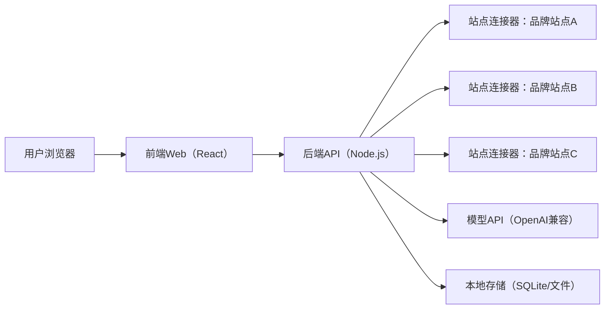
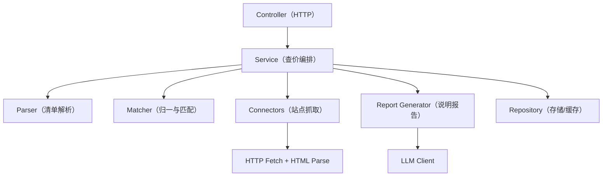
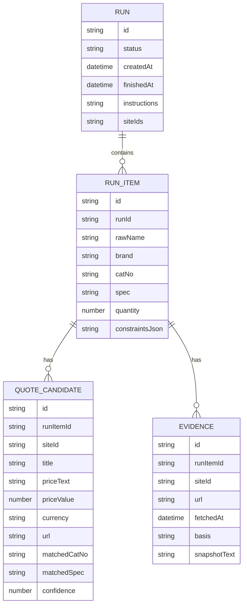

## 1. 架构设计

## 2. 技术选型
- 前端：React@18 + Vite + TailwindCSS（桌面优先）
- 后端：Node.js@18+ TypeScript + Express
- 抓取与解析：
  - HTTP抓取：fetch/undici
  - HTML解析：cheerio
  - 失败降级：返回“需人工打开链接”而非强行浏览器自动化（MVP不引入Playwright）
- 模型接入：OpenAI兼容 Chat Completions（base_url + api_key + model 可配置）
- 存储：
  - MVP：SQLite（任务、物料、候选报价、证据链）或本地JSON文件（实现更快）
  - 缓存：按（keyword + 站点 + 时间窗口）缓存10–60分钟，避免重复触发站点风控
- 部署：
  - 本地/服务器运行：前端静态文件 + 后端API
  - 预留Docker化（可选）

## 3. 路由定义
| 路由 | 用途 |
|------|------|
| / | 查价工作台 |
| /runs/:runId | 结果与报告 |
| /settings | 模型与抓取设置 |

## 4. API 定义（后端）

### 4.1 任务执行
- POST /api/runs
  - 请求：multipart/form-data
    - file：采购清单（xlsx/csv）
    - instructions：采购说明与限价策略文本
    - siteIds：启用站点列表（MVP固定3个，仍保留字段）
  - 响应：
    - runId
    - summary（物料条数、启用站点数）

- GET /api/runs/:runId
  - 响应：
    - run 元信息（状态、开始/结束时间）
    - items（每个物料的推荐与候选）
    - errors（按站点聚合的错误与降级说明）

### 4.2 导出
- GET /api/runs/:runId/export.csv
- GET /api/runs/:runId/report.md

### 4.3 设置
- GET /api/settings
- PUT /api/settings
  - 模型配置：baseUrl、apiKey、model
  - 抓取配置：timeoutMs、maxCandidatesPerSite、cacheTtlMinutes

## 5. 服务端分层结构

## 6. 数据模型

### 6.1 ER 模型

### 6.2 DDL（SQLite，MVP可选）
MVP允许先用本地JSON文件存储以降低复杂度；若启用SQLite，则创建上述实体对应表并为runId、runItemId、siteId建立索引。

