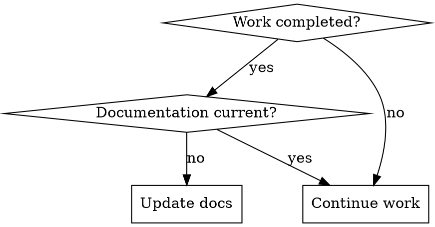

# Update Project Documentation

## Overview

Systematically update project documentation after completing work to maintain accurate, synchronized project records. Updates preserve existing structure while adding new entries, tracking progress, and ensuring consistency across all documentation files.

## When to Use



**Use after:**
- Completing feature implementation
- Finishing bug fixes
- Reaching project milestones
- Significant code refactoring
- Configuration changes
- Ending work session

**Update triggers:**
- New code files added/modified
- Tests written/updated
- Dependencies changed
- Architecture decisions made
- Progress milestones reached
- Errors encountered and resolved

**When NOT to use:**
- Minor typo fixes (edit directly)
- Comment-only changes
- Trivial refactorings

## Quick Reference

| Document | Update Frequency | Key Content |
|----------|------------------|-------------|
| **LOG.md** | Daily/Hourly | Development chronology, decisions |
| **CHANGELOG.md** | Per release | Version changes, features |
| **PROGRESS.md** | Per milestone | Task completion, percentages |
| **CLAUDE.md** | Per architecture change | Project rules, patterns |
| **PROJECT_SPEC.md** | Per scope change | Requirements, specifications |
| **README.md** | Per user-facing change | Usage, installation, features |
| **QUICKREF.md** | Per workflow change | Commands, patterns |
| **USER_QUESTIONS.md** | Per question | Q&A, troubleshooting |

## Core Pattern

### 1. Document Scan

First, identify which documentation files exist:

```bash
# Check for documentation files
ls -1 *.md 2>/dev/null | grep -E "(CLAUDE|CHANGELOG|LOG|PROGRESS|PROJECT_SPEC|QUICKREF|README|USER_QUESTIONS|CONTEXT)" || echo "No markdown files found"
```

### 2. Interactive Mode

Prompt user to select documents to update:

```
Found documentation files:
✓ CLAUDE.md
✓ CHANGELOG.md
✓ LOG.md
✓ PROGRESS.md
✓ README.md

Which documents to update?
[1] All (recommended)
[2] Progress only (LOG, PROGRESS, CHANGELOG)
[3] User-facing only (README, QUICKREF)
[4] Select individually
[5] Cancel
```

### 3. Smart Update Analysis

For each selected document, analyze what needs updating:

**LOG.md:**
- Add new entry with timestamp
- Document work completed
- Note decisions made
- Record issues encountered

**CHANGELOG.md:**
- Add to [Unreleased] section
- Categorize (Added/Changed/Fixed/Removed)
- Follow existing format

**PROGRESS.md:**
- Update completion percentages
- Move tasks from pending to completed
- Add new tasks if needed
- Update milestone status

**README.md:**
- Update feature list if new capabilities
- Modify installation instructions if dependencies changed
- Update examples if usage patterns changed

**CLAUDE.md:**
- Add new patterns/rules if established
- Update project structure if changed
- Document new conventions

### 4. Change Proposal

Show proposed changes before applying:

```markdown
## Proposed Changes for LOG.md

+++ Add new entry +++
### 2025-03-07 18:00
- ✅ Completed environment detector implementation
- 🐛 Fixed TypeScript compilation errors (50+ issues)
- 📝 Updated project documentation

Confirm changes? [Y/n]
```

### 5. Apply with Backup

Before modifying any file:
1. Create backup: `cp FILE.md FILE.md.backup`
2. Apply changes
3. Verify: Read back and confirm
4. On error: Restore from backup

## Batch Update Mode

**Command:** "update all docs"

Updates all documentation files in sequence:

```bash
# 1. Update LOG.md (development log)
# 2. Update PROGRESS.md (task tracking)
# 3. Update CHANGELOG.md (version changes)
# 4. Update README.md (user-facing)
# 5. Update QUICKREF.md (developer reference)
# 6. Update CLAUDE.md (project rules)
# 7. Update PROJECT_SPEC.md (requirements)
```

**Progress indicator:**
```
Updating documentation... [1/7] LOG.md ✓
Updating documentation... [2/7] PROGRESS.md ✓
Updating documentation... [3/7] CHANGELOG.md ✓
...
Documentation update complete! [7/7]
Summary: 7 files updated, 0 errors
```

## Error Handling

### Missing Files

If a documented file doesn't exist:

```bash
# LOG.md not found
Options:
[1] Create new LOG.md with template
[2] Skip LOG.md
[3] Cancel all updates
```

**Template creation:**
```markdown
# Project Development Log

> Daily development chronology

## 2025-03-07

### Project Setup
- Initialized project structure
- Set up TypeScript configuration
```

### File Read Errors

```bash
Error: Cannot read CLAUDE.md (permission denied)
Causes:
- File locked by another process
- Insufficient permissions
- Disk error

Actions:
- Check file permissions: ls -l CLAUDE.md
- Close other programs accessing file
- Retry or skip file
```

### Merge Conflicts

When updates might conflict:

```markdown
## Conflict Detection

LOG.md line 45:
Existing: "### 2025-03-07 10:00"
Proposed: "### 2025-03-07 18:00"

Resolution:
[1] Keep both (append)
[2] Replace existing
[3] Manual merge
[4] Skip this update
```

### Backup and Rollback

All updates create automatic backups:

```bash
# Before update
cp README.md README.md.backup.20250307_180000

# On error
if [ $? -ne 0 ]; then
  echo "Error detected, restoring backup..."
  mv README.md.backup.20250307_180000 README.md
fi
```

## Implementation Scripts

### Document Scanner

```bash
#!/bin/bash
# scan-docs.sh - Find documentation files

DOCS=(
  "CLAUDE.md"
  "CHANGELOG.md"
  "LOG.md"
  "CONTEXT.md"
  "PROGRESS.md"
  "PROJECT_SPEC.md"
  "QUICKREF.md"
  "README.md"
  "USER_QUESTIONS.md"
)

echo "Scanning for documentation files..."
found=()
for doc in "${DOCS[@]}"; do
  if [ -f "$doc" ]; then
    echo "  ✓ $doc"
    found+=("$doc")
  else
    echo "  ✗ $doc (not found)"
  fi
done

echo ""
echo "Found ${#found[@]} documentation files"
```

### Update Function

```bash
#!/bin/bash
# update-doc.sh - Update a single document

update_doc() {
  local doc=$1
  local timestamp=$(date '+%Y-%m-%d %H:%M')

  echo "Updating $doc..."

  # Create backup
  cp "$doc" "$doc.backup.$(date +%Y%m%d_%H%M%S)"

  # Read current content
  local content=$(cat "$doc")

  # Apply updates based on document type
  case "$doc" in
    LOG.md)
      # Add new log entry
      update_log_entry "$doc" "$timestamp"
      ;;
    CHANGELOG.md)
      # Add to unreleased section
      update_changelog "$doc"
      ;;
    PROGRESS.md)
      # Update task status
      update_progress "$doc"
      ;;
    # ... more cases
  esac

  echo "  ✓ $doc updated"
}
```

## Common Mistakes

### ❌ Overwriting Important Content

**Bad:** Replace entire file content
**Good:** Append to appropriate sections, preserve structure

### ❌ Inconsistent Formatting

**Bad:** Mix markdown styles, break existing patterns
**Good:** Match existing format, follow conventions

### ❌ Forgetting Backups

**Bad:** Modify files directly without backup
**Good:** Always create timestamped backup before changes

### ❌ Updating Wrong Files

**Bad:** Update all files without checking relevance
**Good:** Analyze which docs actually need updates

### ❌ Breaking Cross-References

**Bad:** Change section titles without updating links
**Good:** Update all references when restructuring

## Real-World Impact

**Before update-docs:**
- Documentation inconsistent with code
- Progress tracking outdated
- Team confusion about current state
- Lost context between sessions

**After update-docs:**
- All docs synchronized after each work session
- Clear progress history
- Easy onboarding for new team members
- Complete project context preserved

## Triggering Commands

**Interactive mode:**
- "update docs"
- "update documentation"
- "sync docs"

**Batch modes:**
- "update all docs" - Update everything
- "update progress" - LOG, PROGRESS, CHANGELOG only
- "update user docs" - README, QUICKREF only

**Specific documents:**
- "update LOG.md"
- "update changelog"
- "update progress tracking"
